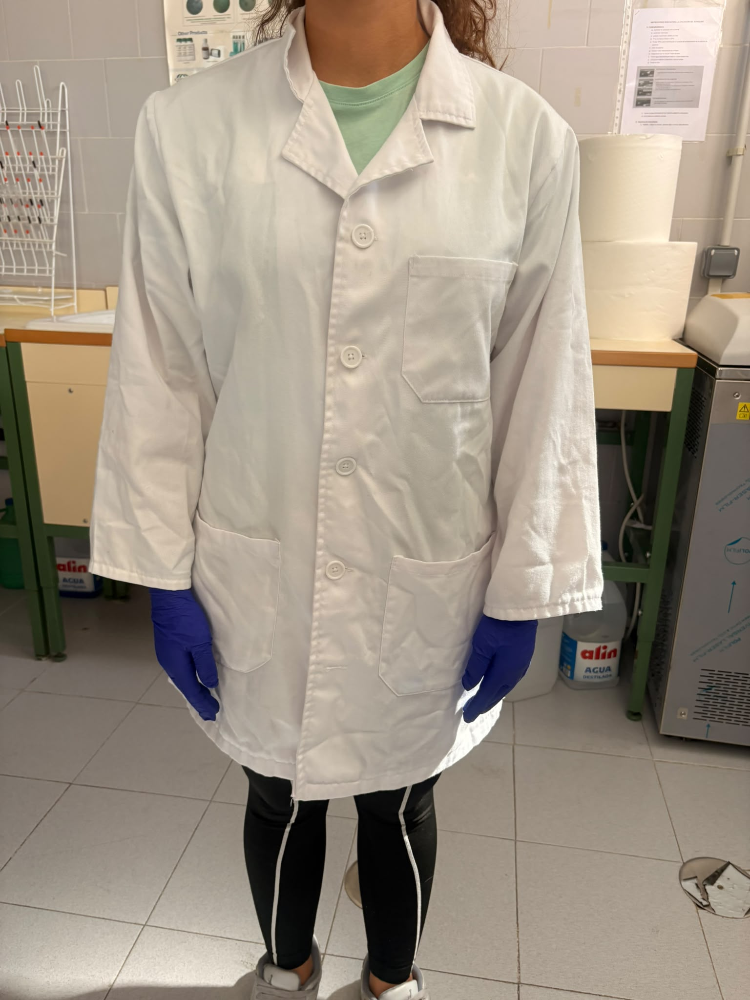
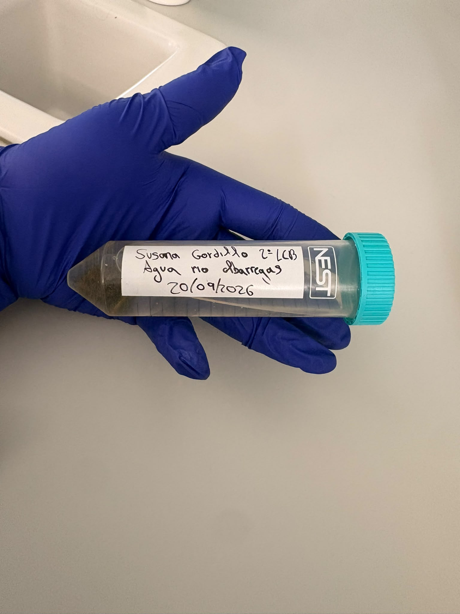
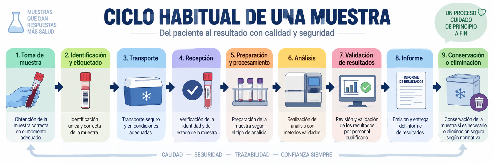
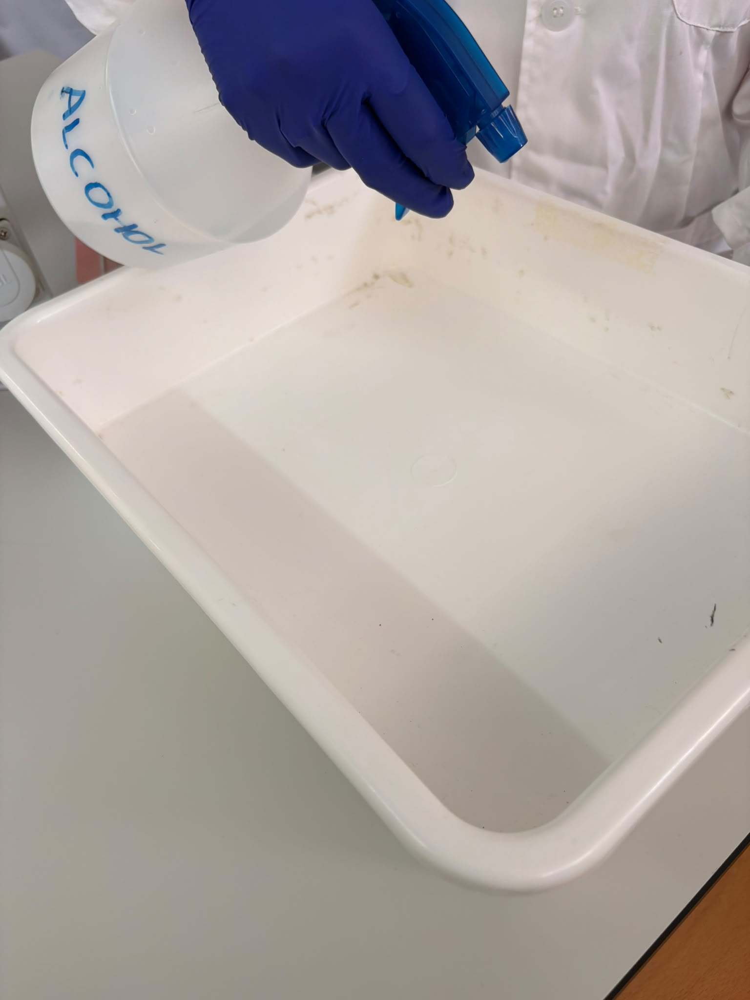
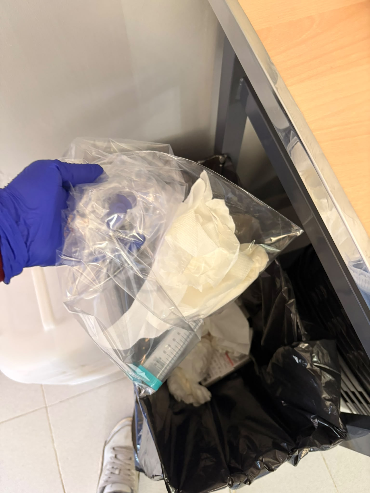

# P01 — Inducción de bioseguridad, riesgos, EPI, residuos y trazabilidad

> **Estado de esta página:** Completa individualmente los bloques **[ALUMNADO · RELLENABLE]** durante o después de la práctica. Si trabajas en pareja, puedes compartir las imágenes del proceso, pero tu registro, interpretación y reflexión deben ser personales.

## 1. Identificación de la práctica

| Campo | Información |
|---|---|
| Código y título | `P01 — Inducción de bioseguridad, riesgos, EPI, residuos y trazabilidad` |
| Unidad didáctica | `UD1 — La microbiología` |
| Resultado de aprendizaje | `RA01` |
| Criterios de evaluación | `CE01.a–CE01.i` |
| Modalidad prevista | Recepción simulada de una muestra líquida, simulación controlada de derrame y resolución individual del registro. |
| Modalidad de seguridad | La modalidad ordinaria utiliza simulante líquido no biológico y material limpio; no se manipulan muestras clínicas ni cultivos salvo autorización expresa del centro y procedimiento validado específico. |

## 2. Resumen

En esta práctica aprenderás a recibir una muestra líquida de forma segura y trazable y a responder ante un derrame simulado. Analizarás el espacio de recepción, la señalización y los peligros antes de seleccionar barreras y EPI. Con una muestra no biológica revisarás la documentación, la identificación, la integridad del envase y el acondicionamiento antes de aceptarla o aislarla. Después provocarás un derrame controlado y aplicarás la respuesta prevista: detener la actividad, señalizar, comunicar, contener, descontaminar y gestionar los residuos. Registrarás las decisiones, los tiempos y las desviaciones. El resultado será un circuito documentado que conecte recepción, incidente, eliminación y trazabilidad. La modalidad ordinaria no usa muestras clínicas ni cultivos; cualquier excepción requiere autorización expresa del centro y un PNT validado.

## 3. Finalidad y resultados esperados

Esta práctica convierte la bioseguridad en un desempeño previo obligatorio, no en un contenido únicamente teórico. Al terminarla deberás poder:

- analizar el espacio de recepción, su señalización y sus condiciones de seguridad;
- identificar peligros y fuentes potenciales de contaminación;
- seleccionar correctamente las barreras y los equipos de protección individual (EPI);
- recibir una muestra líquida simulada y comprobar su documentación, identificación e integridad;
- responder ante un derrame simulado sin generar exposición ni contaminación secundaria;
- segregar, procesar y eliminar los residuos por la ruta autorizada; y
- registrar las decisiones, las incidencias y la trazabilidad de toda la actuación.

## 4. Recursos, riesgos y condiciones de ejecución

**Recursos previstos:** zona de recepción señalizada, simulante líquido no biológico en recipiente primario estanco, envío secundario hermético, solicitud y etiquetas simuladas, bandeja de contención, recipiente secundario de reserva y material de transferencia para el cambio opcional de envase. Kit de derrames: EPI apropiado, absorbente, desinfectante validado, pinzas o recogedor, bolsa o recipiente para residuos, señalización y, si hay punzantes simulados, contenedor rígido resistente a perforaciones. Si no se dispone de kit preparado, se reunirán estos componentes antes de empezar.

**Riesgos que se trabajan:** aceptación de una muestra mal identificada o con fugas, salpicaduras, contaminación de superficies, generación de aerosoles durante un derrame, contacto con desinfectantes y segregación incorrecta de residuos.

**Condiciones de ejecución:** se usará un simulante líquido no biológico, preferentemente coloreado, y material limpio. Se reproducirán de forma realista la recepción, la trazabilidad y las decisiones ante incidencias, sin datos personales ni agentes biológicos. No se manipularán muestras clínicas ni cultivos salvo autorización expresa del centro, procedimiento validado y supervisión. La transferencia de envase será opcional y requerirá autorización docente y zona de contención; la actividad se detendrá ante condiciones imprevistas.

**Medidas generales:** seguir el procedimiento normalizado de trabajo (PNT) del centro, mantener el puesto despejado, separar la documentación de la muestra, usar el EPI indicado, aplicar higiene de manos y respetar el circuito de residuos comunicado por el centro.

**PNT de referencia alternativo:** si el centro no dispone de documentación de referencia validada para la recepción, conservación, descontaminación y gestión de residuos, se tomará como referencia el [Manual de bioseguridad en el laboratorio, cuarta edición, de la OMS (descarga directa del PDF)](https://iris.who.int/bitstream/handle/10665/365600/9789240059306-spa.pdf?sequence=1). Sus indicaciones deberán adaptarse a las instalaciones, los recursos y las normas vigentes del centro; no sustituyen la autorización local.

> **Aviso de seguridad.** La recepción y el derrame se simulan con material no biológico. Los protocolos internos de bioseguridad, residuos e incidencias deben estar validados por el centro antes de aplicarlos como procedimiento real. Esta página no sustituye esos protocolos ni autoriza la manipulación de muestras clínicas.

## 5. Secuencia prevista y criterios de calidad

### Secuencia general

1. Analizar el espacio de trabajo y su señalización.
2. Identificar peligros y fuentes potenciales de contaminación.
3. Seleccionar barreras y EPI adecuados.
4. Llevar a cabo la recepción de la muestra de manera correcta, según el PNT aplicable.
5. Simular un incidente por derrame de la muestra líquida.
6. Resolver la simulación del incidente de manera correcta y segura.
7. Segregar, procesar y eliminar correctamente los residuos propuestos.
8. Registrar la actuación y las decisiones tomadas.

### Procedimientos específicos

**[PNT](https://iris.who.int/bitstream/handle/10665/365600/9789240059306-spa.pdf?sequence=1) de referencia:** [OMS, Manual de bioseguridad en el laboratorio, cuarta edición](https://iris.who.int/bitstream/handle/10665/365600/9789240059306-spa.pdf?sequence=1). Para la descontaminación, consulta también la [monografía complementaria de la OMS sobre descontaminación y gestión de desechos](https://iris.who.int/bitstream/handle/10665/374887/9789240059504-spa.pdf?sequence=1). Si existe un PNT local validado, prevalece sobre estas referencias.

#### Procedimiento 1 — Recogida del envío, recepción y registro de la muestra

1. Confirma la modalidad: la simulación usa simulante y datos ficticios; material real requiere autorización expresa, PNT validado y supervisión. No registres identificadores personales.
2. Prepara la zona señalizada; comprueba iluminación, bandeja, recipiente secundario, desinfectante aprobado, residuos y material de contención.
3. Colócate el EPI previsto para el ejercicio y verifica su integridad; añade protección ocular o facial si la evaluación del riesgo simulado lo requiere.
4. Recoge el envío por su recipiente secundario cerrado, manteniéndolo estable y separado de documentos, material limpio y zonas de paso.
5. Inspecciona el exterior sin abrir: comprueba cierre, integridad, humedad, manchas, fugas y correspondencia entre la identificación del envío y la solicitud.
6. Si el embalaje está dañado o presenta fugas, no lo abras; introdúcelo en el sobreenvase hermético, restringe el acceso y avisa al docente y al responsable.
7. Registra la incidencia simulada y comunica el defecto al remitente ficticio; en una recepción real, se seguiría el circuito de notificación del centro.
8. Si el embalaje está íntegro, abre el recipiente secundario en la zona indicada, con cuidado y sin movimientos bruscos ni salpicaduras.
9. Separa la solicitud del recipiente; protégela y comprueba que no esté contaminada. Registra solo los datos necesarios y nunca identificadores personales.
10. Inspecciona el recipiente primario cerrado; verifica integridad, ausencia de contaminación exterior, etiqueta legible y concordancia con la solicitud.
11. Decide aceptar, aislar o rechazar según los criterios entregados; si no existen, no improvises: registra su ausencia como error o riesgo y detén la aceptación hasta recibir indicación docente.
12. Si el ejercicio lo requiere, transfiere el simulante a un envase compatible en la zona de contención designada; una muestra real requiere autorización expresa, PNT validado y contención apropiada.
13. Conserva identificación y trazabilidad durante la transferencia; en muestras reales, cambia el envase solo con procedimiento local validado y contención apropiada.
14. Cierra el registro, coloca el recipiente aceptado en el envase secundario previsto, ordena la zona, retira el EPI y realiza higiene de manos.

#### Procedimiento 2 — Respuesta ante un derrame simulado

1. En el simulacro, confirma que el simulante es no biológico y que la bandeja está estable; material real exige autorización expresa, PNT validado y supervisión.
2. Comprueba que está disponible el kit; si falta, prepáralo con los componentes enumerados en Recursos. Revisa con el docente el escenario pequeño o hipotético de alto riesgo.
3. Vierte únicamente el simulante dentro de la bandeja, con un recipiente irrompible y sin salpicar, pulverizar ni generar aerosoles deliberadamente; nunca provoques un derrame real.
4. Detén la actividad, avisa a las personas cercanas y no toques, pises, barras ni seques el líquido.
5. Desde una posición segura, valora extensión, ubicación, material implicado, presencia hipotética de aerosoles, objetos cortantes y personas expuestas.
6. Si el escenario representa gran volumen, aerosoles o agente de alto riesgo, simula la evacuación inmediata y restringe el acceso; no inicies la limpieza.
7. Señaliza la zona y comunica el incidente al supervisor y al responsable de bioseguridad, indicando ubicación, material y posibles exposiciones.
8. Representa la respuesta ante una posible exposición: asistencia inmediata y derivación para evaluación médica según el plan de emergencia, sin exponer realmente a nadie.
9. En el escenario de alto riesgo, espera la autorización del responsable antes de reentrar; el tiempo depende de ventilación y protocolo, no de un plazo universal.
10. Para el derrame pequeño contenido, limpia solo tras confirmar el escenario, con el EPI indicado y siguiendo las instrucciones del docente y del centro.
11. Cubre el líquido suavemente con absorbente, sin presionar ni salpicar; evita extenderlo fuera de la bandeja.
12. Aplica el desinfectante aprobado desde el perímetro hacia el centro y respeta la concentración y el tiempo de contacto validados por el centro.
13. Recoge el absorbente con pinzas o útiles; separa los residuos y usa un contenedor rígido únicamente si el escenario incluye punzantes simulados.
14. Descontamina la zona y los útiles reutilizables según el procedimiento indicado, segrega residuos, retira el EPI, realiza higiene de manos y registra decisiones e incidencias.

### Controles de calidad

- Análisis completo de la zona, la señalización y los peligros.
- Recepción trazable y decisión justificada ante envases conformes o irregulares.
- Selección coherente del EPI, contención y descontaminación segura del derrame.
- Segregación, procesamiento y eliminación correctos según la ruta autorizada.
- Registro completo, claro y trazable.

---

# Tu cuaderno de prácticas

## 6. Datos de realización [ALUMNADO · RELLENABLE · DURANTE]

- **Nombre y apellidos:** Leire Lobo Conde 
- **Fecha real de realización:** 23/09/2026
- **Grupo:** 2°LCB
- **Pareja o equipo, si procede:** Trabajo en grupo
- **Rol o tarea principal que realizaste:** técnico de laboratorio 
- **Modalidad realmente realizada:** simulación de derrame 
- **Tipo de muestra o simulante utilizado:** agua del río Albarregas
- **Código o identificación de la muestra:** [Completa sin datos personales]

## 7. Preparación del puesto y análisis inicial [ALUMNADO · RELLENABLE · DURANTE]

### 7.1 Observación del espacio

Describe brevemente cómo estaba organizado el puesto, qué señalización observaste y qué elementos consideraste relevantes para trabajar con seguridad.

No disponemos de zona de recepción de muestras, ni señalizaciones. Trabajamos en un espacio reducido y sin las medidas adecuadas

### 7.2 Riesgos identificados

| Riesgo o fuente de contaminación | Consecuencia posible | Medida preventiva seleccionada |
|---|---|---|
| No disponemos de una zona de recepción de muestras| equivocación en la identificación de las muestras| crear una zona para la recepción de muestras|
| Falta de señalización | desconocimiento de los posibles riesgos biológicos| añadir las señalizaciones adecuadas|
| Escased de materiales para la realización de la práctica| obligación de trabajar en grupos más grandes y como consecuencia problemas de comunicación| comprar más materiales |

### 7.3 EPI y barreras seleccionados

| Elemento | ¿Se utilizó? | Justificación técnica |
|---|---|---|
| Bata u otra prenda de protección | si | medida general de protección|
| Guantes | si | medida general de protección|
| Protección ocular o facial | no | no es necesario para este tipo de práctica|
| Higiene de manos | Antes y después de la práctica| lavar con jabón y abundante agua|
| Otra barrera o medida | desinfección de la mesa de trabajo| impide las posibles contaminaciones|

## 9. Controles y resultados [ALUMNADO · RELLENABLE · DURANTE]

### 9.1 Comprobación de los controles de calidad

| Control o criterio | Evidencia observada | ¿Resultado válido? | Justificación |
|---|---|---|---|
| Zona y señalización analizadas | observamos que no existen zonas ni señalizaciones| no | no es válido porque dificulta el trabajo ya que no disponemos de señalización ni zona de recepción de muestras|
| Recepción e identificación trazables | observamos que no ha sido posible la recepción| no|no es válido porque puede dificultad el error y la identificación de una muestraya que no disponemos de área de recepción|
| Derrame contenido y descontaminado | Se realizó una simulación de derrame controlado. Se delimitó la zona afectada, se aplicó el procedimiento de contención y posteriormente se realizó la limpieza y descontaminación del área utilizando el material adecuado| si|   Es válido porque el derrame pudo ser controlado y la zona afectada fue limpiada y descontaminada siguiendo el procedimiento establecido, evitando la dispersión del material|
| Residuos procesados y eliminados correctamente | Los materiales utilizados durante la simulación fueron recogidos y depositados en los recipientes destinados a los residuos correspondientes| si| Es válido porque los residuos generados durante el procedimiento fueron recogidos y separados adecuadamente para su posterior gestión|
| Registro y comunicación final | Se registró la incidencia simulada y se comunicó el resultado del procedimiento al finalizar la práctica| si| Es válido porque se dejó constancia del derrame simulado y de las actuaciones realizadas, permitiendo comprobar que el procedimiento se había completado correctamente|

### 9.2 Resultado principal de la práctica

Resume qué demuestran tus evidencias sobre tu capacidad para analizar la recepción, aceptar o aislar una muestra, responder a un derrame, gestionar residuos y documentar una actuación segura.

En esta práctica he aprendido a detectar problemas en la recepción de muestras, saber cuándo hay que aislarlas, actuar correctamente ante un derrame y gestionar los residuos. Además, sé dejar registrado lo que se ha hecho y comunicarlo de forma segura.

## 10. Evidencias visuales [ALUMNADO · RELLENABLE · DURANTE Y DESPUÉS]

> Sube imágenes propias y pertinentes. No incluyas rostros, datos personales, documentación sensible ni material cuya fotografía esté prohibida por el centro. Si la imagen procede de una simulación, de material docente o de una fuente externa autorizada, indícalo expresamente. Una imagen no sustituye la explicación técnica.

### Imagen 1 — Preparación o selección de EPI

- **Pie de foto:** Hemos usado las medidas generales de protección tanto bata como guantes
- **Autoría y origen:** Compartida con mi pareja 
- **Momento del procedimiento:** Inicio de la práctica 

### Imagen 2 — Recepción correcta de la muestra

- **Pie de foto:** Se observa un recipiente lleno de agua que hemos obtenido del río Albarregas 
- **Comprobación técnica asociada:** No ha habido una buena recepción de la muestra ya que no tenemos un área de recepción de muestras
- **Momento del procedimiento:** Recepción de la muestra 

### Imagen 3 — Workflow o ciclo habitual de una muestra

- **Pie de figura:** Toma de muestra, identificación y etiquetado,transporte, recepción, preparación, análisis, validación, informe y conservación o eliminación
- **Origen y autorización:** Esquema obtenido de la ia
- **Relación con el procedimiento:** La relación con el procedimiento es el flujo de trabajo que tenemos que seguir en cada práctica 

### Imagen 4 — Simulación del derrame y respuesta inicial

- **Pie de foto:** Simulamos el derrame del contenido del recipiente y usamos papel como material absorbente, después de esto desinfectamos con alcohol 70° y gestionamos los residuos 
- **Medida crítica demostrada:** Se evita en la medida de lo posible la contaminación 
- **Momento del procedimiento:** Como actuamos antes un derrame 

### Imagen 5 — Procesamiento y eliminación correcta de la muestra

- **Pie de foto:** Tenemos como residuos el papel absorbente y el recipiente que al contener agua no tiene ningún tipo de riesgo biológico entonces podemos tirarlo a la basura normal
- **Ruta autorizada:** Al ser residuos sin riesgo biológico lo podemos gestionar como residuos asimilables a urbanos y no necesita ningún tipo de medida especial 
- **Relación con la trazabilidad:** [Explica qué registro o decisión respalda]

## 11. Incidencias, errores y medidas correctoras [ALUMNADO · RELLENABLE · DURANTE]

| Incidencia, error o duda detectada | Posible causa | Medida correctora aplicada o propuesta | ¿Afectó al resultado? |
|---|---|---|---|
| Si se detectaron incidencias |Falta de materiales, de señalización y de área de recepción de muestras| Obtener las cosas que faltan| No afecto debido a que era una práctica muy básica|

## 12. Interpretación técnica [ALUMNADO · RELLENABLE · DESPUÉS]

Interpreta los resultados de la práctica. Relaciona el análisis de la zona, la recepción de la muestra, el EPI seleccionado, la respuesta al derrame y el procesamiento de residuos. Justifica tus decisiones con el PNT del centro o, si no existe, con el manual de la OMS enlazado en el apartado 4.

En la práctica, analicé la zona del derrame y señalicé el área para evitar accidentes. Utilicé bata, guantes y calzado cerrado como EPI. Al tratarse de un derrame de agua, absorbí y limpié la zona de forma segura. Finalmente, retiré los materiales utilizados y los gestioné como residuos, siguiendo las normas del centro. En todo momento adapté las medidas al bajo riesgo del derrame.

## 13. Conclusión [ALUMNADO · RELLENABLE · DESPUÉS]

Indica si alcanzaste el objetivo de la práctica y qué evidencias concretas lo demuestran. Menciona también alguna limitación de la simulación o de la actividad realizada.

Sí, alcancé el objetivo, porque señalicé la zona, utilicé el EPI adecuado, limpié el derrame y gestioné los residuos correctamente.Limitación: fue una simulación con agua, por lo que no se practicó con material biológico real

## 14. Reflexión profesional [ALUMNADO · RELLENABLE · DESPUÉS]

Responde de forma razonada a las cuatro preguntas. Relaciona cada respuesta con datos, observaciones o imágenes incluidas en tu cuaderno.

1. **Procedimiento:** ¿Qué comprobación de la recepción o del derrame consideraste más crítica para evitar una exposición o contaminación, y cómo verificaste que se realizó correctamente?

   La comprobación más crítica fue asegurar y limpiar completamente la zona del derrame para evitar contaminación o accidentes. Verifiqué que no quedaran restos de agua y que la superficie estuviera limpia y seca antes de continuar con la actividad.

2. **Interpretación:** Ante el derrame simulado, ¿qué indicios utilizaste para decidir la contención, la descontaminación y el circuito de residuos? Explica por qué descartaste otras opciones.

   Como era agua sin riesgo biológico, la absorbí, limpié y sequé la zona. Descarté la descontaminación biológica porque no era necesaria.

3. **Conclusiones:** ¿Que evidencia demuestra con mayor claridad que la muestra fue recibida, procesada o eliminada de forma segura y trazable? Justifica la elección.

   La evidencia más clara fue la correcta eliminación del material usado en el derrame, porque comprobé que se recogió y depositó en el recipiente correspondiente de forma segura.

4. **Aprendizaje y transferencia:** ¿Qué hábito concreto aplicarás en las próximas prácticas de microbiología y cómo ayudará a prevenir errores o riesgos reales?

   En próximas prácticas, comprobaré siempre el material y la zona antes de empezar, para prevenir errores, derrames y posibles contaminaciones.

## 15. Trazabilidad y entrega [ALUMNADO · RELLENABLE · DESPUÉS]

| Campo | Registro del alumnado |
|---|---|
| Identificador de práctica | `P01` |
| Fecha | 23/09/2026|
| UD / RA / CE | `UD1 / RA01 / CE01.a–CE01.i` |
| Agrupamiento | En pareja con Susana |
| Materiales o lotes relevantes | [Completa o escribe “No aplicaba”] |
| Controles | [Resume o enlaza al apartado 9] |
| Resultado | [Resume o enlaza al apartado 9.2] |
| Interpretación | [Resume o enlaza al apartado 12] |
| Incidencias y acciones correctoras | [Resume o enlaza al apartado 11] |
| Ruta de residuos aplicada | [Completa]
| Estado de entrega | [Borrador / pendiente de revisión / entregado / corregido] |

---
Mostrando P01_Bioseguridad.md.
