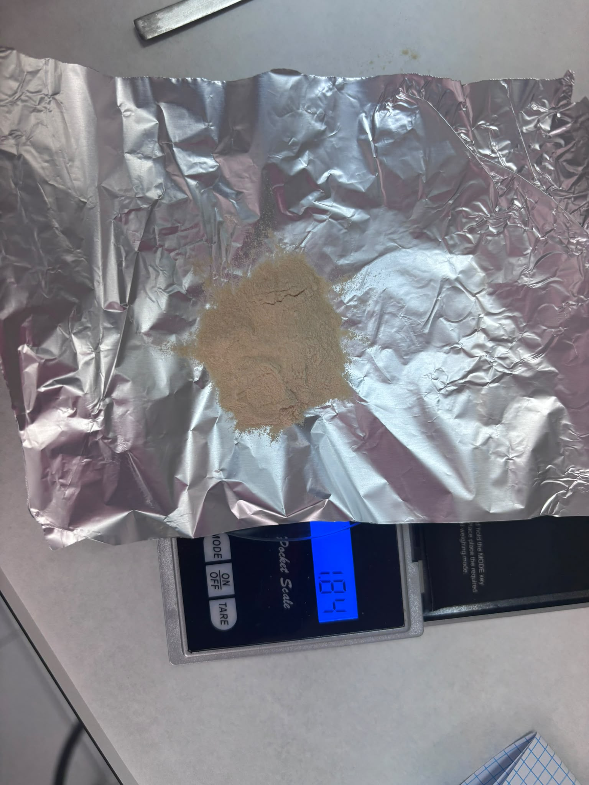
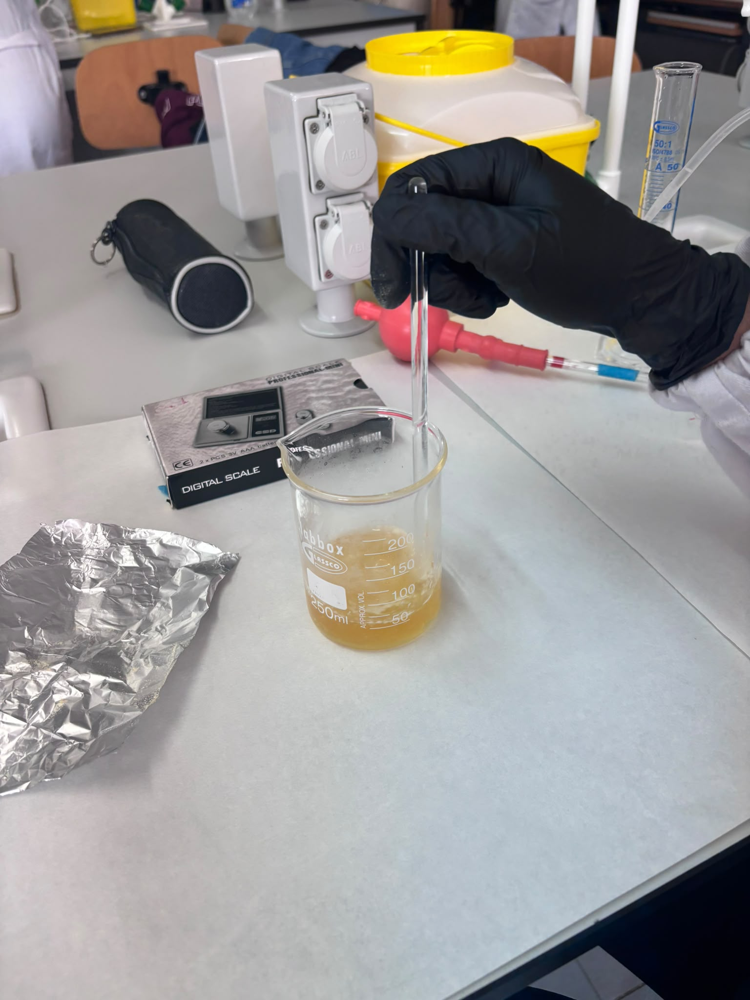
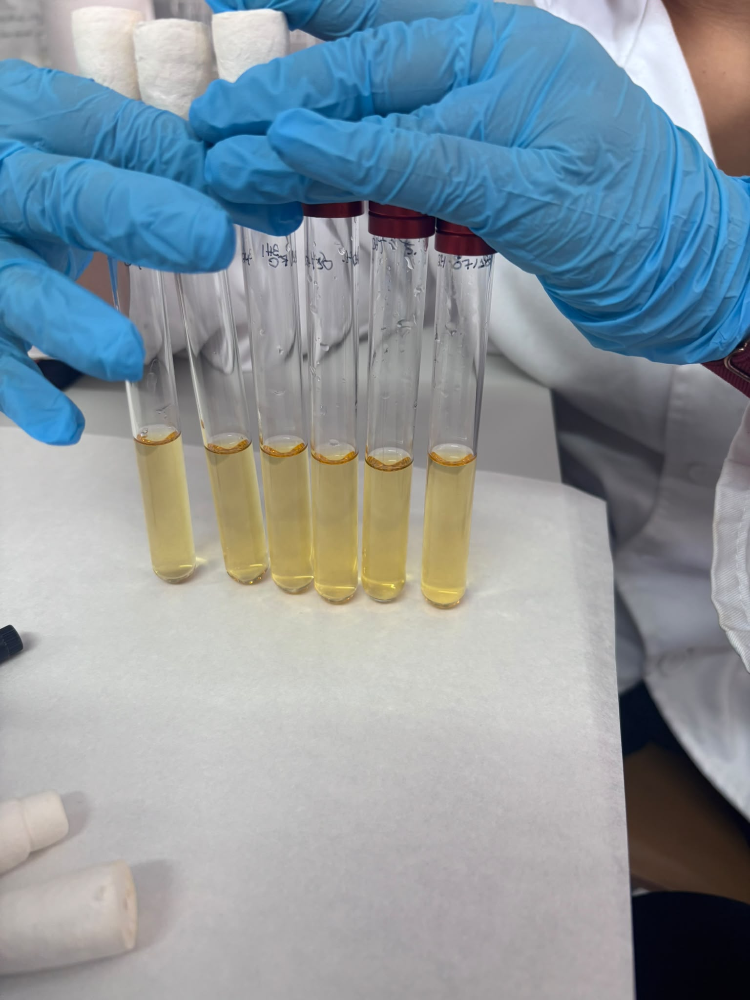
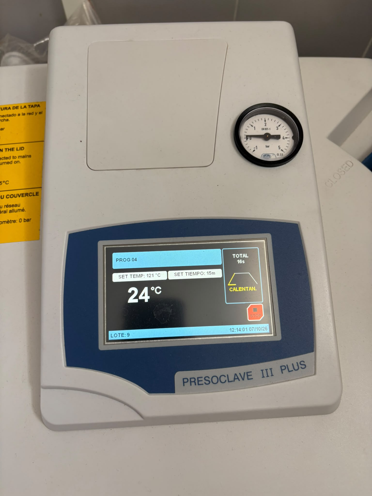

# P07 — Elaboración de caldo BHI: seis tubos de 8 mL por grupo

> **Estado de esta página:** Cada grupo prepara un lote; cada estudiante completa individualmente los cálculos, registros, interpretación y reflexión. Identifica si una fase fue realizada, observada como demostración o analizada documentalmente.

## 1. Identificación de la práctica

| Campo | Información |
|---|---|
| Código y título | `P07 — Elaboración de caldo BHI: seis tubos de 8 mL por grupo` |
| Unidad didáctica | `UD3 — Bacteriología: técnicas de cultivo, aislamiento y recuento` |
| Resultado de aprendizaje | `RA03` |
| Criterios de evaluación | `CE03.a–CE03.h` |
| Aprendizaje transversal | `RA01 — bioseguridad` |
| Agrupamiento | Grupos pequeños; cálculos y registro individuales. |
| Instrumentos vinculados | Prueba práctica, cuaderno o portfolio y prueba teórica. |
| Producto previsto por grupo | Seis tubos con 8 mL de caldo BHI dispensados en cada uno antes de esterilizar. |
| Preparación por grupo | 50 mL según las instrucciones del producto deshidratado. |
| Modalidad y condición operativa | `CONDITIONAL`: producto disponible, tubos compatibles, autoclave operativo y protocolo confirmado. |

## 2. Resumen

Cada grupo elaborará **50 mL de caldo BHI (Brain Heart Infusion)** a partir del medio deshidratado con corrector de pH incorporado. La cantidad de polvo y la preparación con agua destilada se calcularán siguiendo la etiqueta o ficha técnica del producto disponible. Después se dispensarán **8 mL en cada uno de seis tubos** y se esterilizará el medio **ya distribuido en los tubos**, bajo el protocolo autorizado del centro.

Los seis tubos requieren **48 mL**. La diferencia teórica de **2 mL** proporciona un pequeño margen para las pérdidas de transferencia; no garantiza que quede ese volumen como sobrante real. Esta práctica termina con la preparación, esterilización y documentación del medio, sin inoculación.

## 3. Finalidad y resultados esperados

La actividad concreta la finalidad de P07 del programa práctico: preparar, acondicionar, esterilizar y documentar un medio líquido. Al finalizar deberás poder:

- obtener de la etiqueta o ficha técnica la dosis de medio deshidratado y escalarla a 50 mL;
- preparar el caldo BHI con agua destilada sin modificar su formulación;
- dispensar seis alícuotas de 8 mL con material de medida adecuado;
- identificar y acondicionar los tubos para esterilizarlos en autoclave;
- documentar el ciclo, el aspecto final y los controles pendientes; y
- distinguir entre un medio esterilizado y un medio cuya aptitud de uso está comprobada.

## 4. Recursos, seguridad y autorización

**Recursos previstos:** caldo BHI deshidratado con corrector de pH incorporado, etiqueta o ficha técnica y FDS; agua destilada; balanza, espátula y recipiente de pesada; material volumétrico adecuado a 50 mL; recipiente de preparación y agitación; pipeta o dispensador adecuado para medir 8 mL; seis tubos autoclavables con capacidad suficiente para el volumen y el espacio de seguridad; cierres compatibles, gradilla o cestillo autoclavable, etiquetas y autoclave. Si la ficha exige calentamiento, se utilizará el equipo autorizado.

**Riesgos y medidas:** evitar inhalar o dispersar el polvo; usar el EPI indicado por la FDS y el centro; no pipetear con la boca; comprobar el vidrio y los cierres; prevenir quemaduras por líquido caliente, vapor y presión; identificar los tubos antes de esterilizar. No clasifiques automáticamente el caldo sin inocular como residuo infeccioso: aplica la ruta de eliminación indicada por el centro según su composición y posible contaminación.

> **Autorización del autoclave.** Se mantienen los requisitos de `AUTOCLAVE_OPERATIONAL_VALIDATION`, protocolo vigente y personal formado o supervisión autorizada. La carga, ciclo, enfriamiento y apertura se realizan conforme al protocolo del equipo. Si no está autorizada la esterilización real, documenta la preparación y la demostración o evidencia docente; no declares los tubos esterilizados por ti.

## 5. Fundamento técnico

El caldo BHI es un medio nutritivo líquido. Se utiliza la mezcla deshidratada completa; la composición y las condiciones de reconstitución corresponden al producto concreto, no a una fórmula genérica tomada de otra marca. En esta práctica el corrector de pH ya está incorporado: **no se añade corrector ni se ajusta el pH por iniciativa propia**. Si la ficha prescribe comprobar el pH, el docente indicará cómo hacerlo y cómo actuar ante una desviación.

### Cálculo para el lote del grupo

Si la etiqueta expresa la dosis como **C gramos por litro**, la masa para la preparación de 50 mL se calcula así:

**m (g) = C (g/L) × 0,050 L**

Si expresa **M gramos para V mL**, utiliza **m (g) = M (g) × 50 mL / V (mL)**. Copia la dosis real del producto antes de sustituir los valores; no se fija una masa universal para el BHI.

Respeta la redacción de la ficha: «suspender en un volumen de agua» y «completar hasta un volumen final» son instrucciones distintas. Escala a 50 mL la preparación indicada y no añadas agua de nuevo arbitrariamente tras disolver.

**Volumen dispensado: 6 × 8 mL = 48 mL. Margen teórico: 50 − 48 = 2 mL.** No alteres la concentración para compensar pérdidas. Si no alcanza para seis tubos, registra la incidencia y consulta al docente.

## 6. Secuencia de trabajo y controles de calidad

### Secuencia general

Etiqueta/ficha del BHI → cálculo para 50 mL → pesada y reconstitución con agua destilada → seis tubos de 8 mL → esterilización del medio en los tubos → enfriamiento, inspección y registro.

### Procedimiento específico

**[PNT/procedimiento institucional de referencia: Universidad de Granada, «Preparación de medios de cultivo», apartado «Medios líquidos»](https://www.ugr.es/~pomif/pom-bac/pb-i/pb-i-3-metodos.htm).** Se utiliza como referencia docente pública para la rehidratación según el fabricante y el acondicionamiento en tubos antes de esterilizar; no sustituye el protocolo operativo del centro.

1. Lee la etiqueta o ficha técnica del BHI disponible; registra fabricante, referencia, lote, caducidad, dosis, instrucciones de reconstitución y esterilización. Confirma con el docente su aplicación a esta preparación.
2. Comprueba los recursos de 8.1, la limpieza del material y la compatibilidad de seis tubos y cierres con el autoclave. Usa el EPI indicado y verifica la autorización del equipo.
3. Calcula la masa de BHI para 50 mL usando la dosis de la etiqueta. Comprueba que seis tubos de 8 mL requieren 48 mL y dejan un margen teórico de 2 mL.
4. Pesa la masa calculada con la balanza verificada y material limpio. Registra la masa realmente pesada, evita dispersar el polvo y cierra el envase del medio deshidratado.
5. Reconstituye el BHI con agua destilada siguiendo la ficha, incluida la forma de medir el agua o completar el volumen. Homogeneiza; aplica calentamiento solo si lo exige el producto y está autorizado.
6. Comprueba la disolución y el aspecto conforme a la ficha. No añadas corrector de pH: ya está incorporado. Si se exige comprobar el pH, sigue la indicación docente y registra el resultado.
7. Identifica seis tubos con BHI, grupo, fecha y numeración 1–6. Dispensa 8 mL en cada tubo con pipeta o dispensador adecuado; evita contaminar el contenido y conserva el espacio de seguridad.
8. Acondiciona los cierres según el protocolo del autoclave y coloca los tubos verticales en soporte compatible. No esterilices recipientes herméticamente cerrados; registra cualquier sobrante y gestiona su destino según el centro.
9. Esteriliza el caldo ya dispensado en los seis tubos mediante el ciclo validado para líquidos y esta carga. El personal autorizado verificará su compatibilidad con la ficha del BHI; registra ciclo, parámetros y controles.
10. Deja enfriar y descarga solo cuando el equipo y el protocolo lo permitan. Manipula con protección adecuada, comprueba integridad, cierres y aspecto, y registra pérdidas o cambios sin rellenar los tubos por iniciativa propia.
11. Identifica el lote y su estado de control. Conserva los tubos según la ficha y el centro; registra los controles de esterilidad y calidad previstos, realizados o pendientes, sin inocularlos en esta práctica.

### Controles de calidad

- Dosis trazable a la etiqueta/ficha del producto y cálculo para 50 mL verificado.
- Masa pesada y preparación con agua destilada registradas; corrector de pH incorporado, sin adiciones no indicadas.
- Seis tubos identificados y 8 mL dispensados en cada uno antes de esterilizar; incidencias de volumen registradas.
- Aspecto acorde al producto, tubos íntegros y cierre adecuado para cada fase.
- Ciclo del autoclave y controles del proceso documentados. El aspecto por sí solo no acredita esterilidad ni capacidad nutritiva.
- Estado de los controles de esterilidad/calidad y conservación indicado; no afirmar aptitud de uso mientras falte una comprobación exigida.

### Referencias técnicas y alcance

- **Universidad de Granada:** [«Preparación de medios de cultivo», «Medios líquidos» y acondicionamiento para esterilización](https://www.ugr.es/~pomif/pom-bac/pb-i/pb-i-3-metodos.htm). Procedimiento docente sin fecha o versión identificada en la página; consultado el **06/10/2026**.
- **Universidad Miguel Hernández de Elche, Docencia de Microbiología:** [«1. Preparación de medios de cultivo»](https://docenciamicrobiologia.umh.es/indice-de-practicas/1-preparacion-de-medios-de-cultivo/). Corrobora la disolución según el fabricante y la distribución del medio líquido en tubos antes de autoclavar. Sus volúmenes de ejemplo no se trasladan a esta práctica; el encargo docente fija seis tubos de 8 mL. Sin fecha o versión identificada; consultado el **06/10/2026**.
- **Etiqueta/ficha técnica del caldo BHI disponible:** fuente operativa para dosis, reconstitución, características, esterilización y conservación. El alumnado registrará su identificación; fabricante y referencia todavía no aportados.
- **Protocolo del autoclave del centro:** determina la operación segura y el ciclo validado para la carga. Su identificación y parámetros se completarán con el docente.

---

# Tu cuaderno de prácticas

## 7. Datos de realización [ALUMNADO · RELLENABLE · DURANTE]

- **Nombre y apellidos:** Leire Lobo Conde 
- **Fecha real de realización:** 07/10/2026
- **Grupo:** 2°LCB
- **Equipo de trabajo, si procede:** Trabajo en equipo con Marta Polo y Susana Gordillo
- **Rol o tarea principal que realizaste:** técnico de laboratorio 
- **Modalidad realmente realizada:** Preparación completa supervisada
- **Medio preparado:** Caldo BHI; Laboratorios Conda S.A lote:608301
- **Preparación prevista por grupo:** 50 mL según la etiqueta/ficha; seis tubos de 8 mL antes de esterilizar.

## 8. Preparación y análisis inicial [ALUMNADO · RELLENABLE · DURANTE]

### 8.1 Verificación previa

Enumera los recursos que vas a utilizar y los residuos previstos. Escribe «No aplica» cuando corresponda. Para cada residuo, selecciona uno de los tres tipos indicados; confirma su gestión según las instrucciones del centro.

| Elemento | Listado del alumnado |
|---|---|
| Instrumental | papel de filtro, probeta, pipeta de vidrio, seis tubos, vaso de precipitado, agua destilada, cucharilla, báscula, papel de aluminio, varilla, autoclaves, gradilla y reactivo|
| Equipos | báscula, microondas y autoclave|
| Reactivos/materiales | caldo infusión cerebro-corazón|

| Residuo previsto | Tipo |
|---|---|
| Restos de caldo BHI y medio de cultivo utilizado, papel de filtro utilizado, tubos con restos de medio de cultivo, papel de aluminio limpio y otros embalajes limpios | Urbanos o asimilables a los urbanos | asimilables a urbano |

## 9. Observaciones y resultados [ALUMNADO · RELLENABLE · DURANTE]

### 9.1 Registro de observaciones y cálculos

Registra los datos de tu actividad e indica si proceden de ejecución propia, demostración, simulación o material documental. Escribe «No aplica» en cálculos o equipos cuando corresponda; no inventes datos que no estén disponibles.

| Aspecto | Registro del alumnado |
|---|---|
| Cálculos (si procede) |m=37g/L x 0,05L= 1,85g del BHI|
| Configuración de equipos (si procede) | Se utiliza una balanza para pesar 1,85 g de BHI y material de dispensación para repartir el medio en seis tubos. Los datos del autoclave (121°C, 15min)|
| Características del producto o resultado final | Se preparan 6 tubos de 8 mL de BHI, con un volumen total dispensado de 48 mL. Se comprueba el aspecto del BHI, la integridad y el etiquetado de los tubos. Sobrante teórico: 2 mL.|

## 10. Evidencias visuales [ALUMNADO · RELLENABLE · DURANTE Y DESPUÉS]

> Sube imágenes propias, pertinentes y tomadas de acuerdo con las normas del centro. No incluyas rostros, datos personales, etiquetas con información sensible ni material cuya fotografía esté prohibida. Si la evidencia procede de una demostración, de un registro docente o de material preparado, indícalo: no puede presentarse como ejecución propia.

### Imagen 1 — Pesada del BHI deshidratado

- **Archivo previsto:** `../assets/P07/pesada_o_preparacion_de_los_componentes_01.jpg`

*Figura 1. Masa pesada y envase del BHI; documenta la dosis y el lote sin mostrar datos personales.*

- **Pie del alumnado:** Hemos pesado 1,85g de BHI en la báscula encima del papel de aluminio
- **Autoría y modalidad:**  compartida con el grupo 

### Imagen 2 — Disolución del lote de 50 mL

- **Archivo previsto:** `../assets/P07/disolucion_homogeneizacion_o_dispensacion_02.jpg`

*Figura 2. Preparación del BHI con agua destilada; indica cómo se midió el volumen y el aspecto de la disolución.*

- **Pie del alumnado:** Preparamos la disolución 50ml de agua destilada caliente y 1,85g de BHI
- **Autoría y modalidad:** compartida con el grupo 

### Imagen 3 — Dispensación de 8 mL y seis tubos identificados

- **Archivo previsto:** `../assets/P07/dispensacion_seis_tubos_04.jpg`

*Figura 3. Medida de una alícuota y conjunto de seis tubos antes del autoclave; indica el volumen dispensado.*

- **Pie del alumnado:** Repartimos la disolución de 50 ml y echamos 8 ML en cada tubo
- **Autoría y modalidad:**  compartida con el grupo 

### Imagen 4 — Acondicionamiento y registro del ciclo

- **Archivo previsto:** `../assets/P07/acondicionamiento_autoclave_05.jpg`

*Figura 4. Soporte, cierres o registro del ciclo autorizado; identifica si realizaste u observaste esta fase.*

- **Pie del alumnado:** Ponemos todos los tubos en una gradilla y lo introducimos en el autoclave
- **Autoría y modalidad:** compartida con el grupo 

### Imagen 5 — Caldo BHI final y estado de control

- **Archivo previsto:** `../assets/P07/medio_final_etiquetado_o_control_de_calidad_03.jpg`

*Figura 5. Tubos de BHI tras el enfriamiento; describe aspecto, integridad y controles realizados o pendientes.*

- **Pie del alumnado:** [Describe la observación real y su relación con el resultado.]
- **Autoría y modalidad:** [Propia / compartida con el grupo / demostración / documental; especifica.]

Puedes añadir hasta tres evidencias más si son pertinentes; no fabriques imágenes para documentar una fase no realizada. Sube cada archivo a la ruta indicada y comprueba la vista previa.

## 11. Incidencias, errores y medidas correctoras [ALUMNADO · RELLENABLE · DURANTE]

| Incidencia, error o duda detectada | Posible causa | Medida correctora aplicada o propuesta | ¿Afectó al resultado? |
|---|---|---|---|
| No se detectaron incidencias durante la preparación y dispensación del medio BHI.| No procede. Se siguió el procedimiento establecido y se mantuvieron las condiciones de trabajo previstas.| No fue necesaria ninguna medida correctora. Se propone mantener las mismas condiciones de preparación, identificación, dispensación y esterilización.| No|

## 12. Interpretación técnica [ALUMNADO · RELLENABLE · DESPUÉS]

Interpreta si el lote de BHI cumple la dosis de su ficha, la preparación de 50 mL, la dispensación de seis tubos de 8 mL y los criterios de homogeneidad, acondicionamiento, identificación y esterilización previstos. Explica qué evidencia sostiene esa valoración, qué resultado dejarías como pendiente hasta completar el control de esterilidad y por qué un medio aparentemente correcto no garantiza por sí solo su aptitud para uso posterior.

El lote de BHI parece estar bien preparado, ya que se ha seguido el procedimiento indicado y se han repartido seis tubos con 8 mL cada uno. Aunque se han preparado 50 mL, se han dispensado 48 mL, por lo que se han perdido 2 mL durante el proceso. A simple vista, el medio puede parecer correcto, pero todavía hay que comprobar que está estéril y que no se ha contaminado. Por eso, hasta tener el resultado del control de esterilidad, no podemos asegurar que esté listo para utilizarlo en los cultivos.

## 13. Conclusión [ALUMNADO · RELLENABLE · DESPUÉS]

¿El resultado obtenido y el procedimiento realizado cumplen el objetivo de obtener un medio de cultivo listo para la inoculación y el cultivo de bacterias? Justifica brevemente tu conclusión.

El procedimiento realizado cumple aparentemente el objetivo de preparar y distribuir el medio BHI para el cultivo de bacterias. Se han preparado 50 mL y se han dispensado seis tubos de 8 mL, siguiendo las condiciones de trabajo previstas. Sin embargo, no se puede confirmar que el medio esté listo para su uso hasta completar el control de esterilidad y verificar que se mantienen las condiciones adecuadas de conservación e identificación.

## 14. Reflexión profesional [ALUMNADO · RELLENABLE · DESPUÉS]

Responde de forma razonada a las cuatro preguntas. Relaciona cada respuesta con cálculos, observaciones o imágenes incluidas en tu cuaderno.

**1. Procedimiento:** ¿Qué precaución específica tomaste al elegir los tapones o cierres de los tubos antes de introducirlos en el autoclave y qué consecuencias de seguridad habría tenido cerrarlos herméticamente?

   Dejamos los tapones ligeramente flojos para permitir la entrada del vapor. Si los hubieramos cerrado herméticamente, podría haberse acumulado presión y haber roto los tubos.

**2. Interpretación:** El procedimiento indica que no se debe añadir corrector de pH, pero que podría exigirse su comprobación. Si tuvieras que medir el pH del BHI reconstituido, ¿en qué momento exacto del procedimiento descrito lo harías y por qué sería un error medirlo *después* de que los tubos salgan del autoclave?

   Mediría el pH después de preparar el medio y antes de esterilizarlo, para comprobar que es correcto antes de que el calor pueda modificarlo.

**3. Conclusiones:** Si dentro de unos días observaras que uno de los tubos almacenados presenta turbidez sin haber sido inoculado por nadie, ¿qué fallo en el procedimiento, material o equipo deducirías que ha ocurrido?

   La turbidez indicaría una posible contaminación, causada por un fallo en la esterilización o durante la manipulación. No utilizaría ese tubo y revisaría el procedimiento.

**4. Aprendizaje y transferencia:** Imagina que en un laboratorio real te piden escalar esta preparación para hacer 150 tubos de 8 mL de BHI. ¿Cómo modificarías tus cálculos iniciales de masa y volumen total (incluyendo un margen de seguridad proporcional)?

Para preparar 150 tubos de 8 mL necesitaría 1200 mL de medio. Si la proporción es de 37 g de BHI por litro, necesitaría 44,4 g de compuesto para preparar los 1,2 L.

## 15. Trazabilidad y entrega [ALUMNADO · RELLENABLE · DESPUÉS]

| Campo | Registro del alumnado |
|---|---|
| Identificador de práctica | `P07` |
| Fecha | 07/10/2026|
| UD / RA / CE | `UD3 / RA03 / CE03.a–CE03.h` |
| Agrupamiento | Trabajo en equipo con Marta Polo y Susana Gordillo|
| Medio, dosis y preparación | [BHI: 37 g/L. Para 50 mL se necesitan 1,85 g de BHI. |
| Dispensación y esterilización | Se prepararon seis tubos con 8 mL cada uno. Se identificaron y se esterilizaron siguiendo el procedimiento establecido. |
| Componentes, lotes y caducidades relevantes | BHI en polvo, agua destilada y tubos de cultivo|
| Controles | Comprobar el aspecto del medio, los volúmenes y el resultado del control de esterilidad.|
| Resultado | Medio BHI preparado y repartido en seis tubos. La esterilidad queda pendiente de confirmación |
| Interpretación | La preparación parece correcta, pero hay que confirmar la esterilidad antes de utilizar el medio. |
| Incidencias y acciones correctoras | No se detectaron incidencias durante la preparación y dispensación. |
| Ruta de residuos y conservación | Gestionamos los residuos como asimilables urbanos|
| Estado de entrega | [Borrador / pendiente de revisión / entregado / corregido] |

---
Mostrando P07_Medio_liquido.md.
